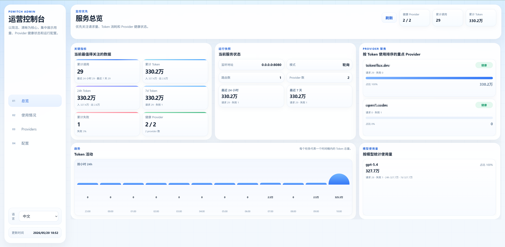

# pswitch

English | [中文](README_ZH.md)

`pswitch` 是一个本地多 Provider 代理，适合把多个上游模型服务统一收口到一个稳定的本地入口，并提供自动切换、熔断恢复和可视化后台。

## 截图



## 核心能力

- 多个上游 Provider 自动切换
- 熔断与后台健康恢复探测
- 三种路由模式：
  - `round_robin`
  - `sequential`
  - `least_failures`
- 默认支持 OpenAI 风格路由
- 可选 Anthropic 风格协议适配
- 内置 `/dashboard/` 管理后台
- 持久化统计请求数、Token、失败次数、按模型使用量
- 运行配置支持页面编辑，尽量热更新
- 运行态文件持久化到当前目录：
  - `settings.json`
  - `metrics.json`

## 快速开始

```bash
make build
./bin/pswitch
```

打开：

```text
http://127.0.0.1:8080/dashboard/
```

如果没有配置文件，程序会使用内置默认配置直接启动：

- 监听 `127.0.0.1:8080`
- 模式为 `round_robin`
- 默认路由为 `/codex`
- 不预置 Provider

## 文档

- [配置说明](docs/config.md)
- [使用方法](docs/usage.md)
- [日志](docs/logging.md)
- [故障排查](docs/troubleshooting.md)
- [开发](docs/development.md)
